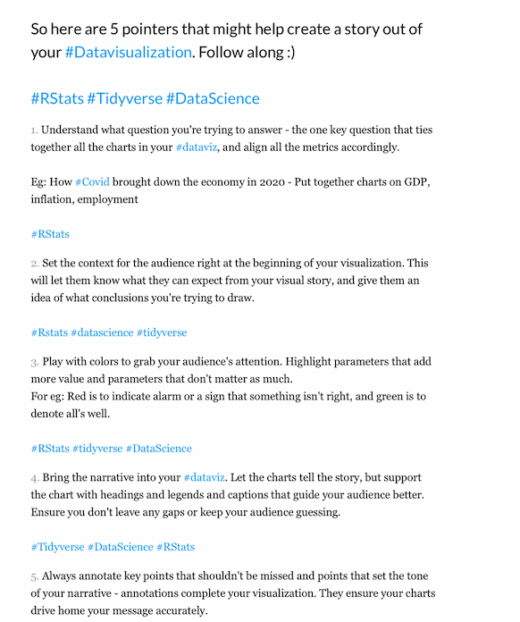

```{r setup, include=FALSE}
knitr::opts_chunk$set(echo = TRUE)
```

### United Nations Life expectancy data

The data is a subset of that available from <https://population.un.org/wpp/Download/Standard/CSV/>.


```{r,  eval=F }
load("life.Rdata") # gives you data called life
```


The variables are

-  ISO3_code
-  Location: country
-  Time: year
-  TPopulation1July: Total Population, as of 1 July, in thousands
- LEx: Life Expectancy at Birth, both sexes, in years
- LExMale: Male life Expectancy at Birth, in years
- LExFemale:Female life Expectancy at Birth, in years
- LE15: Life Expectancy at Age 15, both sexes
- LE15Male: Male life Expectancy at age 15, in years
- LE15Female: Female life Expectancy at age 15, in years

### Assignment

You should write a report with three parts:

1. State some questions appropriate for the data.

2. Write a paragraph detailing the subset of the data relevant to your questions, an overview of its structure, and whether any adjustments to the data are required.

3. For each of the questions you posed, build visualisations that provide an answer. Write a paragraph describing
the information gleaned from the visualisation and how it answers your question.

Your written report including graphs and tables should be a maximum of three pages in length. Your report should not assume prior familiarity with the data. You should supply in a separate file the code necessary to produce the results. 

Write your report in Rmarkdown (or quarto). In Rstudio, do File>New File> R markdown to get started. You will find lots of help for this online.


### Hints

Useful links <https://clauswilke.com/dataviz/telling-a-story.html>


And these pointers are from twitter:

```{r, echo=F, eval=T, out.width="50%", fig.align='center'}

```

